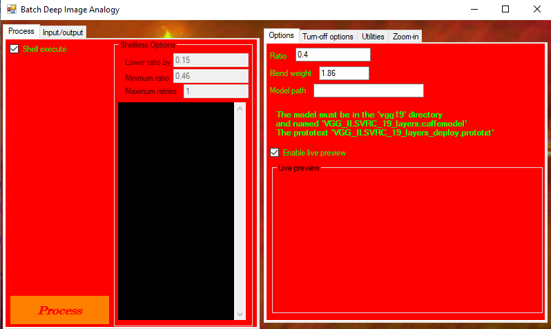
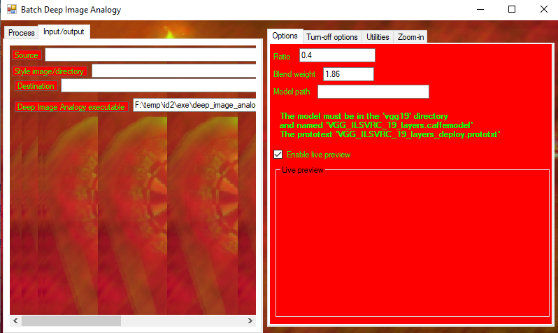

# Batch Deep Image Analogy
Allows you to cooperate with <a href="https://github.com/msracver/Deep-Image-Analogy">Deep Image Analogy</a> in order to make it process several frames with the same style..

</img>
</img>

<a href="/Binaries/BatchDeepImageAnalogy.exe"><b>Binary download</b></a>